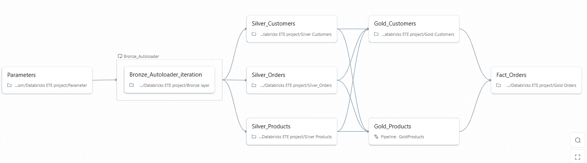

# 🚀 Databricks End-to-End Azure Data Engineering Project

---

## 📌 **Overview**

This project demonstrates a **complete, real-world Azure Data Engineering pipeline** built using **Azure Databricks, Azure Data Lake Storage Gen2, Unity Catalog, and Apache Spark**.

The pipeline ingests **real-time and incremental data** from Azure Data Lake, processes it through **Bronze → Silver → Gold layers** using the **Medallion Architecture**, and produces **analytics-ready Star Schema tables** suitable for BI tools like **Power BI**.

This project closely follows **industry best practices** and showcases key data engineering concepts such as **Auto Loader, Structured Streaming, Delta Lake, SCD Type 2, Unity Catalog governance, and PySpark OOPS**.

---

## 🏗️ **Architecture**

---

## 🧰 **Tech Stack**

- **Cloud**: Microsoft Azure  
- **Storage**: Azure Data Lake Storage Gen2 (ADLS)  
- **Compute**: Azure Databricks (Serverless)  
- **Processing Engine**: Apache Spark (PySpark)  
- **Streaming**: Spark Structured Streaming + Auto Loader  
- **Metadata & Governance**: Unity Catalog  
- **Data Format**: Delta Lake  
- **Version Control**: GitHub (Databricks Repos)  

---

## 🔹 **Bronze Layer – Raw Data Ingestion**

### **Purpose**
Ingest raw data from Azure Data Lake in **real-time / incremental mode**.

### **Key Features**
- Databricks Auto Loader  
- Spark Structured Streaming  
- Schema inference and evolution  
- Checkpointing for fault tolerance  
- No transformations (raw ingestion)  

### **Output**
- Raw Delta tables stored in the **Bronze layer**

---

## 🔸 **Silver Layer – Data Cleaning & Transformation**

### **Purpose**
Transform raw Bronze data into **clean, standardized, business-ready datasets**.

### **Key Operations**
- Schema enforcement  
- Data type casting  
- Null handling & validation  
- Deduplication  
- Column standardization  
- Business logic transformations  

### **Engineering Concepts Used**
- PySpark transformations  
- Reusable functions  
- Object-Oriented Programming (OOPS) in PySpark  

### **Output**
- Cleaned Delta tables in the **Silver layer**

---

## ⭐ **Gold Layer – Analytics & Data Modeling**

### **Purpose**
Create **analytics-ready dimensional models** for reporting.

### **Key Features**
- Star Schema design  
- Dimension & Fact tables  
- Slowly Changing Dimension (SCD Type 2)  
- Delta Live Tables (DLT) / PySpark merge logic  
- Optimized for BI queries  

### **Example Tables**
- `DimProducts`  
- `DimCustomers`  
- `FactOrders`  

---

## 🔄 **Slowly Changing Dimension (SCD Type 2)**

- Tracks historical changes in dimension tables  
- Preserves old records with versioning  
- Maintains current and historical state  
- Implemented using **PySpark / DLT `apply_changes`**

---

## 🔐 **Data Governance with Unity Catalog**

- Centralized metadata management  
- Catalog → Schema → Table hierarchy  
- Managed Delta tables  
- Secure access control  
- Separation of storage and compute  

---

## ⚙️ **Orchestration & Automation**

- Databricks Jobs & Pipelines  
- Parameterized notebooks  
- Incremental ingestion using checkpoints  
- Triggered pipelines for Gold layer  

---
